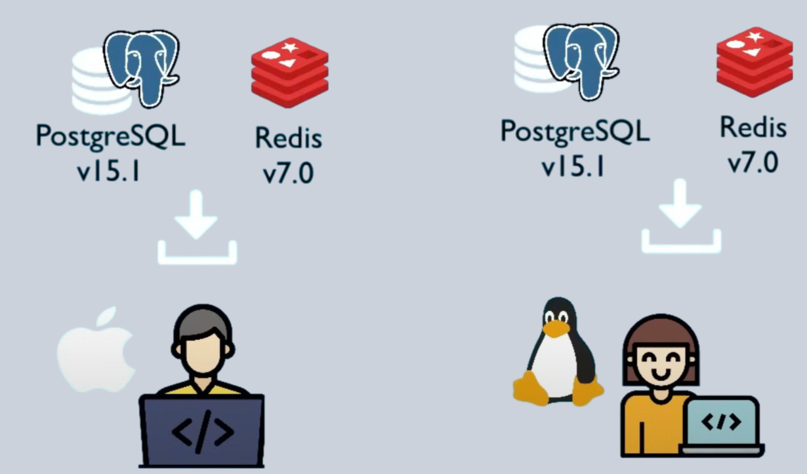
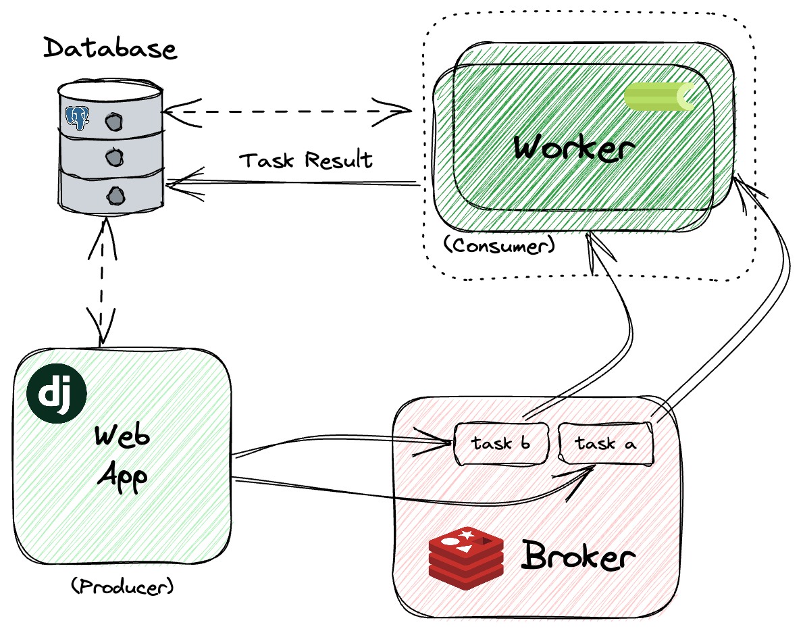

## Welcome

While people are coming in: How are you doing?


<!-- TODO: Update link -->

or go to [menti.com](https://menti.com/) and use code XXXX XXXX

---

## Packaging and sharing data science applications as Docker container images

---

## Who we are

- SciLifeLab -> SciLifeLab Data Centre -> SciLifeLab Serve team
- Today:
    - Johan Alfredéen
    - Hamza Imran Saeed
- serve@scilifelab.se

---

## Who you are


<!-- TODO: Update link -->

or go to menti.com and use code XXXX XXXX

---

<!-- TODO: Update link -->

<section data-background-iframe="https://www.mentimeter.com/app/presentation/alhxr8rtvrksuu9ni6egtmkde8zzx7iu/embed" data-background-interactive>
</section>


---

Find the written tutorial for today here:


[bit.ly/47vwato](http://bit.ly/47vwato)

---
## Today's plan

<!-- TODO: This slide could be made less intimidating -->

- Part 1. Introduction to Docker Containers
    - Basics and example apps (35 minutes)
    - Hands-on part (20 minutes)
- Break (10 minutes)
- Part 2. Packaging your application as a Docker image (demo, 15 minutes)
- Part 3. Hosting your application on SciLifeLab Serve (demo, 15 minutes)
- More hands-on + Q&A, wrap-up (remaining time)

---

## Part 1: Introdcution to Docker Containers

---

### What is a Docker?

- Virtualization software
- Simplifies development and deployment of application
- Packages application with all dependencies into a container
- Ensures reproducibility and scalability
- Facilitates collaboration by sharing applications and their running environments

---

#### Containers: packages of your application code together with dependencies

---

### Development process before containers

<div>
<ul>
<li>Each developer needs to install and configure all services directly on their local machine</li>

<li>Installing process different for each OS (Windows, Mac, Linux)</li>
<li>Many installation steps, things can go wrong</li>
<li>Complex apps with multiple services cause more issues</li>
</ul>
</div>


---

### Complex Applications

<!-- .element height="50%" width="50%" -->


---

### Containers solve this issue

<div>
<ul>

<li> Service packaged as an isolated environment</li>
<li>Postgres packaged with all dependencies and configs</li>
<li>Start service as Docker container</li>
<li>Same command for all OS and services</li>
<li>Standardizes process of running services on local dev enironment</li>
<li>Run different versions of same app running on local environment</li>
</ul>
</div>

<!-- .element height="20%" width="20%" -->

---

### Deployment process before containers

- Development team produces software and provides installation instructions
- Operations team installs and configures apps and dependencies
- Setup Environment and Install, uninstall packages and dependencies on the server; error prone
- Download data;
- Dependency conflicts
- Complex process, miscommunication


---

### With Containers
- Standardized, self contained packaged software;
- Includes code as well as dependencies and env configurations
- Platform-agnostic (Linux, Mac, Windows);
- Less room for errors   

---

### Containers in software development

<ul style="font-size: 35px;">
    <li>Portability:
        <ul>
            <li>Consistent behavior across different environments</li>
            <li>Eliminates “it works on my machine” issues</li>
        </ul>
    </li>
    <li>Efficiency:
        <ul>
            <li>Uses fewer resources than traditional VMs</li>
            <li>Faster startup times and better resource utilization</li>
        </ul>
    </li>
    <li>Isolation:
        <ul>
            <li>Independent running environments</li>
            <li>Prevents conflicts between applications and dependencies</li>
        </ul>
    </li>
    <li>CI/CD Simplification:
        <ul>
            <li>Consistent environment for testing and deployment</li>
            <li>Accelerates development cycles and improves software quality</li>
        </ul>
    </li>
    <li>Extensive Ecosystem:
        <ul>
            <li>Access to a vast repository of pre-built images on Docker Hub</li>
            <li>Quick deployment of a wide range of applications and services</li>
        </ul>
    </li>
</ul>


---

### Docker Container vs Docker Images

<table style="font-size: 30px;">
    <tr>
        <th>Aspect</th>
        <th>Docker Images</th>
        <th>Docker Containers</th>
    </tr>
    <tr>
    <td>Definition</td>
        <td>Read-only templates that define the environment and include the application code, libraries, dependencies, and tools needed to run an application.</td>
        <td>Runnable instances of Docker images that provide an isolated environment for applications.</td>
    </tr>
    <tr>
        <td>Creation</td>
        <td>Built using a Dockerfile with the <code>docker build</code> command.</td>
        <td>Created from images using the <code>docker run</code> or <code>docker create</code> command.</td>
    </tr>
    <tr>
        <td>State</td>
        <td>Immutable (read-only).</td>
        <td>Mutable (read-write).</td>
    </tr>
    <tr>
        <td>Purpose</td>
        <td>Serve as a blueprint for creating containers.</td>
        <td>Run applications in a consistent and isolated environment.</td>
    </tr>
    <tr>
    <td>Storage</td>
    <td>Can be stored locally or in a Docker registry (e.g., Docker Hub).</td>
    <td>Exist on the host machine where they are run.</td>
    </tr>
</table>
<br>
<ul style="font-size: 30px;float: left;">
<li>Multiple containers from one image</td>
</ul>


---

### Container Registries

- What are Container Registries?
    - Storage locations for Docker images.
    - Enable sharing and distribution of images.
- Types of Repositories:
    - Public Repositories: Accessible by anyone.
    - Private Repositories: Restricted access for specific users or teams.
- Benefits:
    - Centralized storage for images.
    - Facilitates collaboration and sharing.
    - Simplifies deployment processes.

---

### DockerHub

- The largest public repository for Docker images
- Hosted by Docker Inc.
    - Enable sharing and distribution of images.
- Public and Private Repositories: Store images with varying access levels
- Automated Builds: Automatically build images from GitHub or Bitbucket repositories
- Official Images: Curated and maintained, ensuring high quality and security

---

### Docker Image Versioning

`docker pull {name}:{tag}`  = Pull image from a registry

- **Purpose**: Ensures consistent and reliable deployments by tracking changes and updates to Docker images.
- **Importance**: Helps manage dependencies, rollbacks, and updates effectively.
- **Tags**: Labels assigned to images to differentiate versions.
  - Example: `ubuntu:22.04`, `myapp:v1.0.0`
- **Use Specific Tags**: Avoid using `latest` tag for production.
  - Example: `docker pull ubuntu:22.04` instead of `docker pull ubuntu:latest`
- **Implement a Versioning Strategy**: Use semantic versioning (e.g., `major.minor.patch`) or date-based versioning (e.g., `YYYY-MM-DD`).

---

### Docker basic commands

- **`docker images`** : Lists all Docker images on the local machine
- **`docker ps`** : Lists all currently running containers
- **`docker pull {name}:{tag}`**: Pull image from a registry
- **`docker run {name}:{tag}`**: Download image from a registry and run container
- **`docker build -t {name}:{tag} .`**: Builds a Docker image from a Dockerfile in the current directory


---

### Writing a Dockerfile

To build a Docker image, you need to create a Dockerfile. It is a plain text file with instructions and arguments. Here is the description of the instructions we're going to use in our next example:

- FROM -- set base image
- RUN -- execute command in container
- ENV -- set environment variable
- WORKDIR -- set working directory
- COPY -- copy files into the container
- ENTRYPOINT -- specifies the command that will always be executed when a container starts


---

### Dockerfile Example

```dockerfile
# Select base image (can be ubuntu, python, shiny etc)
FROM python:3.11-slim

# Create user name and home directory variables. 
# The variables are later used as $USER and $HOME. 
ENV USER=username
ENV HOME=/home/$USER

# Add user to system
RUN useradd -m -u 1000 $USER

# Set working directory (this is where the code should go)
WORKDIR $HOME

# Update system and install dependencies.
RUN apt-get update && apt-get install --no-install-recommends -y \
    build-essential \
    software-properties-common

# Copy code and start script (this will place the files in home/username/)
COPY requirements.txt $HOME/requirements.txt
COPY main.py $HOME/main.py
# copy any other files that are needed for your app with the directory structure as your files expect
COPY start-script.sh $HOME/start-script.sh
COPY data/ $HOME/app/data

RUN pip install --no-cache-dir -r requirements.txt \
    && chmod +x start-script.sh \
    && chown -R $USER:$USER $HOME \
    && rm -rf /var/lib/apt/lists/*

USER $USER
EXPOSE 7860

ENTRYPOINT ["./start-script.sh"]
```
---

### Time for hands-on work

- **Option 1:** 
- **Option 2:**

---

## Part 2: Packaging application as a Docker Container Image to deploy on Scilifelab Serve

---

### Pre requisites for deployment

- To host your app on SciLifeLab Serve, you first need to package it as a Docker image.
- If you don't have docker, you can install it from [docs.docker.com/get-docker](https://docs.docker.com/get-docker/).

---

Demo

---

## Part 3: Publishing your app on SciLifeLab Serve

---

### SciLifeLab Serve

- https://serve.scilifelab.se/;
- Platform for hosting applications and machine learning models;
- Free to use for life science researchers affiliated with a Swedish research institution and their international collaborators;
- Each app receives 2 vCPU, 4GB RAM by default; more can be requested with demonstrated need.

---

Demo

---

## Time for hands-on work

We are happy to help and answer questions. 

Options:
- Continue working on your app
- Try packaging your app as a Docker image
- Try publishing an app on SciLifeLab Serve

---

## That's it from us. Thank you!

Please fill out the evaluation form you will receive by email.

---

## Syntax highlighting

```python
def hello_world():
    print("Hello world!")
```

Press down

----

## Highlight lines

```python [1|3-6]
n = 0
while n < 10:
  if n % 2 == 0:
    print(f"{n} is even")
  else:
    print(f"{n} is odd")
  n += 1
```

---

# Slide with two columns

<div class="container">
    <div class="col">
        <p>Column 1</p>
    </div>
    <div class="col">
        <p>Column 2</p>
    </div>
</div>

---
# How to make stuff appear on by one

Use "fragmet" class

```html
<p class="fragment">This will appear first</p>
<p class="fragment">This will appear second</p>
```

<p class="fragment">This will appear first</p>
<p class="fragment">This will appear second</p>

---

# Using pyscript

<button id="my_button">Click me!</button>
<div id="output-py"></div>
<py-script>
from pyscript import when, display
@when("click", "#my_button")
def click_handler(event):
    display("I've been clicked!", target="output-py")
</py-script>

----

## Adding a hover button that would show code snippet
<py-script>
from pyscript import when, display
@when("click", "#my_button-1")
def click_handler_1(event):
    display("I've been clicked!", target="output-py-1")
</py-script>
<div>
    <button id="my_button-1">Click me!</button>
    <div class="info-icon">
        <!-- if you have fontawesome installed -->
        <!-- <i class="fa-solid fa-code fa-lg"></i> -->
        Hover over me
        <div style="width: 600px" class="tooltip">
            <div class="code-snippet">
                <pre style="all: initial; font-size: 20px">
                <code>
<py-script>
from pyscript import when, display
@when("click", "#my_button-1")
def click_handler_1(event):
    display("I've been clicked!", target="output-py-1")
</py-script>
                </code>
            </div>
        </div>
    </div>
</div>
<div id="output-py-1"></div>


