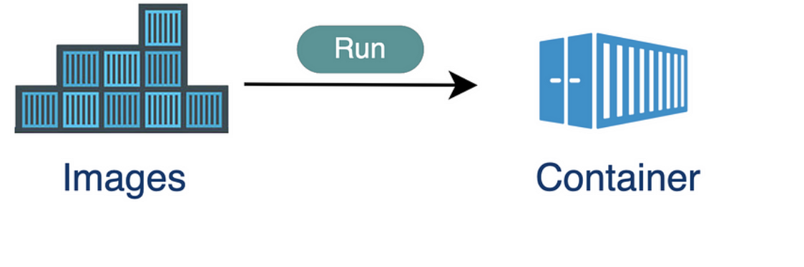

## Welcome

While people are coming in: How are you doing?

<div style='position: relative; padding-bottom: 56.25%; padding-top: 35px; height: 0; overflow: hidden;'><iframe sandbox='allow-scripts allow-same-origin allow-presentation' allowfullscreen='true' allowtransparency='true' frameborder='0' height='315' src='https://www.mentimeter.com/app/presentation/n/alkw2z5dj2ur7ersxdiid42g73qo5b7k/embed' style='position: absolute; top: 0; left: 0; width: 100%; height: 70%;' width='420'></iframe></div>

or go to [menti.com](https://menti.com/) and use code 4560 7682

---

## Packaging and sharing data science applications as Docker container images

---

## Who we are

- SciLifeLab -> SciLifeLab Data Centre -> SciLifeLab Serve team
- Today:
    - Johan Alfredéen
    - Hamza Imran Saeed
    - Nikita Churikov
- serve@scilifelab.se

---

## Who you are


<div style='position: relative; padding-bottom: 56.25%; padding-top: 35px; height: 0; overflow: hidden;'><iframe sandbox='allow-scripts allow-same-origin allow-presentation' allowfullscreen='true' allowtransparency='true' frameborder='0' height='315' src='https://www.mentimeter.com/app/presentation/n/alkw2z5dj2ur7ersxdiid42g73qo5b7k/embed' style='position: absolute; top: 0; left: 0; width: 100%; height: 70%;' width='420'></iframe></div>

or go to menti.com and use code 4560 7682


---

## Today's plan

<!-- TODO: This slide could be made less intimidating -->

- Part 1. Introduction to Docker Containers
    - Basics and example commands (25 minutes)
    - Hands-on part (30 minutes)
- Break (10 minutes)
- Part 2. Hosting your application on SciLifeLab Serve (demo, 20 minutes)
- More hands-on + Q&A, wrap-up (remaining time)

---

## Part 1: Introduction to Docker Containers

---
<style>

code {
    color: #b93d59f2;
    font-weight: 580;
}
.code{
    color: #4e9098;
    font-weight: 580;
}
.container{
    display: flex;
}
.col{
    flex: 1;
    font-size: 30px;
}
.rounded {
    border-radius: 4px;
} 
</style>

### Containers
<div class="container">

<div class="col">

</div>
<div class="col">
<ul>
    <li style="font-weight: bold;">Before Containers:
        <ul>
            <li style="font-weight: normal;">Load, offload, reload</li>
            <li style="font-weight: normal;">Slow, unreliable</li>
        </ul>
    </li>
    <li style="font-weight: bold;">Using Containers:
        <ul>
            <li style="font-weight: normal;">Standardized unit of cargo</li>
            <li style="font-weight: normal;">Transport on:</li>
             <ul>
            <li style="font-weight: normal;">Ship</li>
            <li style="font-weight: normal;">Train</li>
            <li style="font-weight: normal;">Truck</li>
            <li style="font-weight: normal;">....</li>
            </ul>
            <li style="font-weight: normal;">Efficient, simple</li>
        </ul>
    </li>
</ul>
<!-- .element: style="width: 100%;" -->

</div>
</div>
---

### (Software) Containers

<div class="container">
<div class="col">

</div>
<div class="col" style="margin-top: 2%;">
<ul>
    <li style="font-weight: bold;">Before Containers:
        <ul>
            <li style="font-weight: normal;">Install, uninstall, reinstall</li>
            <li style="font-weight: normal;">Slow, unreliable</li>
        </ul>
    </li>
    <li style="font-weight: bold;">Using Containers:
        <ul>
            <li style="font-weight: normal;">Standardized unit of software</li>
            <li style="font-weight: normal;">Run on:</li>
             <ul>
            <li style="font-weight: normal;">Linux</li>
            <li style="font-weight: normal;">Windows</li>
            <li style="font-weight: normal;">Mac</li>
            <li style="font-weight: normal;">....</li>
            </ul>
            <li style="font-weight: normal;">Efficient, simple</li>
        </ul>
    </li>
</ul>
<!-- .element: style="width: 100%;" -->
</div>
</div>
A container is a <span style="font-weight: bold;">standard unit of software</span> that packages up <span style="font-weight: bold;">code and its dependencies</span> so that the application runs reliably on <span style="font-weight: bold;">different computing environments</span>.

---

<div class="container">

<div class="col">

<ul>
    <li style="font-weight: bold;">Portability:
        <ul>
            <li style="font-weight: normal;">Consistent behavior across different environments</li>
            <li style="font-weight: normal;">Eliminate “it works on my machine” issues</li>
        </ul>
    </li>
    <li style="font-weight: bold;">Scalability:
        <ul>
            <li style="font-weight: normal;">Work very well with cloud orchestration tools</li>
        </ul>
    </li>
    <li style="font-weight: bold;">Efficiency:
        <ul>
            <li style="font-weight: normal;">Use fewer resources than traditional VMs</li>
            <li style="font-weight: normal;">Faster startup times and better resource utilization</li>
        </ul>
    </li>
</ul>
<!-- .element: style="width: 100%;" -->

</div>
<div class="col">

<ul>
    <li style="font-weight: bold;">Isolation:
        <ul>
            <li style="font-weight: normal;">Independent running environments</li>
            <li style="font-weight: normal;">Prevent conflicts between different apps</li>
        </ul>
    </li>
    <li style="font-weight: bold;">Productivity:
        <ul>
            <li style="font-weight: normal;">Quick deployment of a wide range of applications and services</li>
        </ul>
    </li>
    <li style="font-weight: bold;">Community:
        <ul>
            <li style="font-weight: normal;">Access to a vast repository of pre-built images on container resgitries</li>
        </ul>
    </li>
</ul>
<!-- .element: style="width: 100%;" -->

</div>
</div>

<div class="container">
<div class="col" >


</div>
</div>

---

### Collaborative process before containers
<div class="container">
<div class="col">
<ul>
<li>Each researcher needs to install software directly on their local machine</li>
<li>Installing process different for each OS (Windows, Mac, Linux)</li>
<li>Many installation steps, things can go wrong</li>
<li>Complex apps with multiple services cause more issues</li>
</ul>
</div>
</div>
<div class="col" >

</div>
---

### Containers solve this issue

<div class="container">
<div class="col" >

</div>
<div class="col" style="margin-top: 4%;">
<ul>
<li>Application packaged as an isolated environment</li>
<li>Packaged with all dependencies and configs</li>
<li>Start service as Docker container</li>
<li>Same command for all OS and services</li>
<li>Standardizes process of running services on local enironment</li>
<li>Run different versions of same app</li>
</ul>
</div>
</div>


---

## What is Docker?

<div class="container">
<div class="col" >

</div>
<div class="col">
<ul style="margin-top: 5%;">
<li>Containerisation toolkit</li>
<li>Build, deploy and manage applications</li>
<li>Docker Engine and CLI is open source</li>
<li>Docker Desktop</li>
<ul>
<li>Commercial offering sold by Docker that combines Docker Engine with additional features</li>
<li>Free for academic and non commercial use</li>
<li>Owned by Docker Inc</li>
<ul>
</ul>
</div>
</div>

---

### Terminology

<div class="container">

<div class="col" style="margin-top: 3%;">

<ul>
    <li><span style="font-weight: bold;">Docker Images:</span> Blueprints of the application and dependencies</li>
    <li><span style="font-weight: bold;">Docker Containers:</span> Instances of a Docker Image</li>
    <li ><span style="font-weight: bold;">Docker Daemon:</span> Background service running on the host that listens to API calls (via the Docker client), manages images and builds, runs and distributes containers</li>
    <li><span style="font-weight: bold;">Docker Client:</span> The command line tool that allows the user to interact with the daemon.</li>
    <li><span style="font-weight: bold;">Docker Hub:</span> A registry of Docker Images</li>
    <li><span style="font-weight: bold;">Docker Host:</span> The host machine that the docker daemon runs on</li>
</ul>
<!-- .element: style="width: 100%;" -->

</div>

<div class="col" >


</div>
</div>

---

### Docker Images vs Docker Containers

<table style="font-size: 28px;">
    <tr>
        <th></th>
        <th>Docker Images</th>
        <th>Docker Containers</th>
    </tr>
    <tr>
    <td style="font-weight: bold;">Definition</td>
        <td>Read-only templates that define the environment and include the application code, libraries, dependencies, and tools needed to run an application.</td>
        <td>Runnable instances of Docker images that provide an isolated environment for applications.</td>
    </tr>
    <tr>
        <td style="font-weight: bold;">Creation</td>
        <td>Built using a Dockerfile with the <code>docker build</code> command.</td>
        <td>Created from images using the <code>docker run</code> or <code>docker create</code> command.</td>
    </tr>
    <tr>
        <td style="font-weight: bold;">State</td>
        <td>Immutable (read-only).</td>
        <td>Mutable (read-write).</td>
    </tr>
    <tr>
        <td style="font-weight: bold;">Purpose</td>
        <td>Serve as a blueprint for creating containers.</td>
        <td>Run applications in a consistent and isolated environment.</td>
    </tr>
    <tr>
    <td style="font-weight: bold;">Storage</td>
    <td>Can be stored locally or in a Docker registry (e.g., Docker Hub).</td>
    <td>Exist on the host machine where they are run.</td>
    </tr>
</table>



---

### From Dockerfile to Container


---

### Writing a Dockerfile

<div class="container">
<div class="col">
<ul style="font-size: 35px;margin-top: 15%;">
<li><span style="font-weight: bold;">FROM</span> -- set base image</li>
<li><span style="font-weight: bold;">RUN</span> -- execute command in the image</li>
<li><span style="font-weight: bold;">ENV</span> -- set environment variable</li>
<li><span style="font-weight: bold;">WORKDIR</span> -- set working directory</li>
<li><span style="font-weight: bold;">COPY</span> -- copy files into the image</li>
<li><span style="font-weight: bold;">CMD</span> -- specifies the command that will always be executed when a container starts</li>
</ul>
</div>
<div class="col" >

</div>
</div>

---

### Container Registry

<div class="container">
<div class="col">
<ul style="margin-top: 10%;">
<li style="font-weight: bold;">What is Container Registry?</li>
<ul>
<li>Storage locations for Docker images</li>
<li>Enable sharing and distribution of images</li>
</ul>
<li style="font-weight: bold;">Types of Registries</li>
<ul>
<li><span style="font-weight: bold;">Public Registry</span>: Accessible by anyone</li>
<li><span style="font-weight: bold;">Private Registry</span>: Restricted access for specific users or teams</li>
</ul>
<li style="font-weight: bold;">Benefits</li>
<ul>
<li>Centralized storage for images</li>
<li>Facilitates collaboration and sharing</li>
</ul>
</div>
<div class="col" >

</div>
</div>


---

### DockerHub

<div class="container">
<div class="col">
<ul style="font-size: 35px;margin-top: 15%;">
<li>The largest public registry for Docker Images</li>
<li>Hosted by Docker Inc</li>
<li>Enable sharing and distribution of images</li>
<li><span style="font-weight: bold;">Public and Private Repositories:</span> Store images with varying access levels</li>
<li><span style="font-weight: bold;">Official Images</span>: Curated and maintained, ensuring high quality and security</li>
</ul>
</div>
<div class="col" >

</div>
</div>

---

### Docker Image Tags

`{image-repository}/{image-name}:`<code class="code">{tag}</code>

- **Purpose**: Labels assigned to images to differentiate versions.
  - Example: `ubuntu:`<code class="code">22.04</code>, `scilifelabdatacentre/workshop-flask-web-app:`<code class="code">v1.0.0</code>
- **Use Specific Tags**: Avoid using <code class="code">latest</code> tag for production.
  - Example: `docker pull ubuntu:`<code class="code">22.04</code> instead of `docker pull ubuntu:`<code class="code">latest</code>
- **Importance**: Helps manage dependencies, rollbacks, and updates effectively.
- **Implement a Versioning Strategy**: Use semantic versioning (e.g., <code class="code">major.minor.patch</code>) or date-based versioning (e.g., <code class="code">YYYY-MM-DD</code>).

---

### Docker basic commands

- **`docker images`** : Lists all Docker images on the local machine
- **`docker ps`** : Lists all currently running containers
- **`docker pull {name}:{tag}`**: Pull image from a registry
- **`docker run {name}:{tag}`**: Download image from a registry and run container
- **`docker build -t {name}:{tag} .`**: Builds a Docker image from a Dockerfile in the current directory

---

Demo

---

### Time for hands-on work

The hands-on guide is available at [docker-workshop.serve.scilifelab.se](https://docker-workshop.serve.scilifelab.se)

---

## Part 2: Publishing your app on SciLifeLab Serve

---

### SciLifeLab Serve

- https://serve.scilifelab.se/;
- Platform for hosting applications and machine learning models;
- Free to use for life science researchers affiliated with a Swedish research institution and their international collaborators;
- Each app receives 2 vCPU, 4GB RAM by default; more can be requested with demonstrated need.

---

Demo

---

## Time for hands-on work

We are happy to help and answer questions. 

Options:
- Continue working on your app
- Try packaging your app as a Docker image
- Try publishing an app on SciLifeLab Serve

---

## That's it from us. Thank you!

Any questions?

Feel free to get in touch with the SciLifeLab Serve team with questions: serve@scilifelab.se

---

## Syntax highlighting

```python
def hello_world():
    print("Hello world!")
```

Press down

----

## Highlight lines

```python [1|3-6]
n = 0
while n < 10:
  if n % 2 == 0:
    print(f"{n} is even")
  else:
    print(f"{n} is odd")
  n += 1
```

---

# Slide with two columns

<div class="container">
    <div class="col">
        <p>Column 1</p>
    </div>
    <div class="col">
        <p>Column 2</p>
    </div>
</div>

---
# How to make stuff appear on by one

Use "fragmet" class

```html
<p class="fragment">This will appear first</p>
<p class="fragment">This will appear second</p>
```

<p class="fragment">This will appear first</p>
<p class="fragment">This will appear second</p>

---

# Using pyscript

<button id="my_button">Click me!</button>
<div id="output-py"></div>
<py-script>
from pyscript import when, display
@when("click", "#my_button")
def click_handler(event):
    display("I've been clicked!", target="output-py")
</py-script>

----

## Adding a hover button that would show code snippet
<py-script>
from pyscript import when, display
@when("click", "#my_button-1")
def click_handler_1(event):
    display("I've been clicked!", target="output-py-1")
</py-script>
<div>
    <button id="my_button-1">Click me!</button>
    <div class="info-icon">
        <!-- if you have fontawesome installed -->
        <!-- <i class="fa-solid fa-code fa-lg"></i> -->
        Hover over me
        <div style="width: 600px" class="tooltip">
            <div class="code-snippet">
                <pre style="all: initial; font-size: 20px">
                <code>
<py-script>
from pyscript import when, display
@when("click", "#my_button-1")
def click_handler_1(event):
    display("I've been clicked!", target="output-py-1")
</py-script>
                </code>
            </div>
        </div>
    </div>
</div>
<div id="output-py-1"></div>